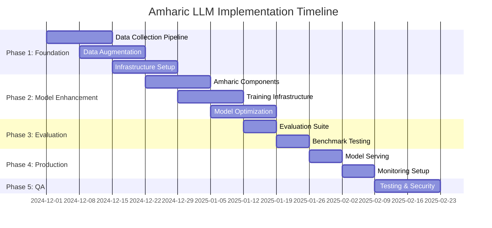

# Amharic LLM Implementation Plan

**Based on Technical Review**: `/amharic-hnet/amharic-llm-review.md`  
**Created**: December 2024  
**Status**: Ready for Implementation

## Overview

This implementation plan addresses the critical issues identified in the technical review and provides a structured roadmap to transform the current Amharic H-Net prototype into a production-ready system.

## Critical Issues to Address

1. **Dataset Scaling**: Current 7,178 words → Target 7M+ words (1000x increase)
2. **Model Architecture**: Add Amharic-specific optimizations
3. **Evaluation Framework**: Implement comprehensive benchmarks
4. **MLOps Infrastructure**: Production deployment pipeline
5. **Performance Optimization**: Inference speed and scalability

## Phase 1: Foundation & Data Scaling (Weeks 1-4)

### 1.1 Enhanced Data Collection Pipeline

**Deliverables**:
- [ ] Parallel data collector with retry logic
- [ ] Multi-source integration (ENA, Addis Standard, EBC)
- [ ] Data quality validation pipeline
- [ ] Automated corpus preprocessing

**Implementation**:
```python
# File: enhanced_data_collector.py
class AmharicDataCollector:
    def __init__(self, max_workers=10):
        self.executor = ThreadPoolExecutor(max_workers=max_workers)
        self.retry_strategy = ExponentialBackoff(max_retries=3)
        self.sources = [
            'wikipedia_am',
            'ena_articles', 
            'addis_standard',
            'ebc_news',
            'opus_corpus'
        ]
```

**Target Metrics**:
- Collection rate: 1000+ articles/hour
- Success rate: >90%
- Data quality score: >85%
- Total corpus size: 1M+ words by end of phase

### 1.2 Data Augmentation Framework

**Deliverables**:
- [ ] Back-translation pipeline (Amharic ↔ English/Arabic)
- [ ] Morphology-aware synonym replacement
- [ ] Sentence shuffling with coherence preservation
- [ ] Noise injection for robustness

**Implementation**:
```python
# File: data_augmentation.py
class AmharicDataAugmentation:
    def __init__(self):
        self.techniques = [
            BackTranslation(languages=['en', 'ar']),
            SynonymReplacement(amharic_wordnet),
            RandomInsertion(preserve_morphology=True),
            SentenceShuffling(maintain_coherence=True)
        ]
```

### 1.3 Local Development & Kaggle Setup

**Deliverables**:
- [ ] Local development environment (macOS)
- [ ] Kaggle API integration for dataset management
- [ ] Git-based experiment tracking
- [ ] Simple monitoring with local logs

**Implementation**:
```bash
# Setup local environment
pip install kaggle transformers torch
kaggle datasets download -d your-username/amharic-corpus

# Kaggle notebook template
# File: kaggle_training_template.ipynb
!pip install transformers torch
import os
os.environ['KAGGLE_USERNAME'] = 'your-username'
os.environ['KAGGLE_KEY'] = 'your-api-key'
```

## Phase 2: Model Architecture Enhancement (Weeks 5-8)

### 2.1 Amharic-Specific Model Components

**Deliverables**:
- [ ] Morphological encoding layer
- [ ] Script-aware attention mechanism
- [ ] Amharic positional encoding
- [ ] Fidel-optimized tokenizer

**Implementation**:
```python
# File: amharic_enhanced_transformer.py
class AmharicEnhancedTransformer(nn.Module):
    def __init__(self, config):
        super().__init__()
        
        # Morphological Encoding Layer
        self.morphological_encoder = MorphologicalEncoder(
            fidel_size=config.fidel_vocabulary_size,  # ~350 characters
            embedding_dim=config.hidden_size
        )
        
        # Script-Aware Attention
        self.script_attention = ScriptAwareMultiHeadAttention(
            hidden_size=config.hidden_size,
            num_heads=config.num_attention_heads,
            use_fidel_position=True
        )
```

### 2.2 Training Infrastructure (Kaggle-Optimized)

**Deliverables**:
- [ ] Kaggle notebook-based training pipeline
- [ ] Mixed precision training for GPU efficiency
- [ ] Gradient accumulation for large batch simulation
- [ ] Checkpoint saving to Kaggle datasets

**Implementation**:
```python
# File: kaggle_training.py
class KaggleAmharicTrainer:
    def __init__(self, model, dataset, config):
        self.model = model.cuda() if torch.cuda.is_available() else model
        self.gradient_accumulation_steps = config.gradient_accumulation
        self.mixed_precision = config.use_amp
        self.kaggle_output_path = '/kaggle/working/'
        
    def save_checkpoint(self, epoch):
        # Save to Kaggle working directory for dataset creation
        torch.save(self.model.state_dict(), 
                  f'{self.kaggle_output_path}/model_epoch_{epoch}.pt')
```

### 2.3 Model Optimization

**Deliverables**:
- [ ] Quantization-aware training
- [ ] Knowledge distillation pipeline
- [ ] Model pruning strategies
- [ ] ONNX export capability

## Phase 3: Evaluation & Benchmarking (Weeks 9-10)

### 3.1 Comprehensive Evaluation Suite

**Deliverables**:
- [ ] Amharic-specific BLEU implementation
- [ ] Morphological accuracy metrics
- [ ] Named entity recognition evaluation
- [ ] Semantic similarity benchmarks

**Implementation**:
```python
# File: evaluation_suite.py
class AmharicEvaluationSuite:
    def __init__(self):
        self.metrics = {
            'perplexity': PerplexityMetric(),
            'bleu': AmharicBLEU(),
            'morphological_accuracy': MorphologicalAccuracy(),
            'named_entity_f1': AmharicNERMetric(),
            'semantic_similarity': AmharicSentenceSimilarity()
        }
```

### 3.2 Benchmark Datasets

**Deliverables**:
- [ ] Amharic-GLUE benchmark suite
- [ ] WMT-Amharic translation tasks
- [ ] Amharic-SQuAD reading comprehension
- [ ] Cultural knowledge evaluation

### 3.3 Performance Testing

**Deliverables**:
- [ ] Latency benchmarks (<100ms inference)
- [ ] Throughput testing (requests/second)
- [ ] Memory usage profiling
- [ ] GPU utilization optimization

## Phase 4: Production Infrastructure (Weeks 11-12)

### 4.1 Model Serving Infrastructure (Free Deployment)

**Deliverables**:
- [ ] Hugging Face Spaces Gradio interface
- [ ] GitHub Pages static site with ONNX.js
- [ ] Local FastAPI development server
- [ ] Client-side inference optimization

**Implementation**:
```python
# File: app.py (Hugging Face Spaces)
import gradio as gr
from transformers import AutoTokenizer, AutoModelForCausalLM

def generate_amharic(text):
    # Load model and generate
    tokenizer = AutoTokenizer.from_pretrained("./amharic-hnet")
    model = AutoModelForCausalLM.from_pretrained("./amharic-hnet")
    inputs = tokenizer(text, return_tensors="pt")
    outputs = model.generate(**inputs, max_length=100)
    return tokenizer.decode(outputs[0], skip_special_tokens=True)

iface = gr.Interface(fn=generate_amharic, inputs="text", outputs="text")
iface.launch()
```

### 4.2 Monitoring & Observability

**Deliverables**:
- [ ] Prometheus metrics collection
- [ ] Grafana dashboards
- [ ] Error tracking with Sentry
- [ ] Performance alerting

**Implementation**:
```python
# File: monitoring.py
class ModelMetrics:
    def __init__(self):
        self.inference_counter = Counter(
            'amharic_model_inference_total',
            'Total number of inference requests'
        )
        self.inference_latency = Histogram(
            'amharic_model_inference_duration_seconds',
            'Inference request duration'
        )
```

### 4.3 Deployment Pipeline

**Deliverables**:
- [ ] CI/CD pipeline with GitHub Actions
- [ ] Model versioning system
- [ ] A/B testing framework
- [ ] Rollback mechanisms

## Phase 5: Testing & Quality Assurance (Weeks 13-14)

### 5.1 Comprehensive Test Suite

**Deliverables**:
- [ ] Unit tests (80% coverage target)
- [ ] Integration tests
- [ ] Performance regression tests
- [ ] Security vulnerability scans

**Implementation**:
```python
# File: test_amharic_model.py
class AmharicModelTests(unittest.TestCase):
    def test_morphological_handling(self):
        """Test model handles Amharic morphology correctly"""
        test_cases = [
            ("ቤቶች", "ቤት"),  # plural handling
            ("የተጻፈው", "ጻፈ"),  # verb conjugation
        ]
```

### 5.2 Load Testing

**Deliverables**:
- [ ] Stress testing with realistic workloads
- [ ] Concurrent user simulation
- [ ] Resource utilization analysis
- [ ] Bottleneck identification

### 5.3 Security Audit

**Deliverables**:
- [ ] API security assessment
- [ ] Input validation testing
- [ ] Rate limiting verification
- [ ] Authentication/authorization review

## Implementation Timeline



## Resource Requirements

### Team Structure
- **Data Engineering** (2 developers): Data collection, preprocessing, augmentation
- **ML Engineering** (2 developers): Model architecture, training optimization
- **MLOps Engineer** (1 developer): Infrastructure, deployment, monitoring
- **QA Engineer** (1 developer): Testing, benchmarks, quality assurance

### Infrastructure (Local-First Approach)
- **Training**: Kaggle Notebooks (30h/week GPU quota)
- **Local Development**: MacOS development environment
- **Inference**: Hugging Face Spaces + GitHub Pages (completely free)
- **Storage**: Local storage + Kaggle datasets (20GB limit)
- **Backup**: GitHub for code, Kaggle for models

### Budget Estimate (Zero Cost)
- **Kaggle**: $0 (free tier sufficient for prototyping)
- **Hugging Face Spaces**: $0 (free tier)
- **GitHub Pages**: $0 (free static hosting)
- **Data Sources & APIs**: $0 (open sources only)
- **Monitoring & Tools**: $0 (open source alternatives)
- **Total**: $0/month = $0 for entire project

## Success Metrics

### Technical Metrics
- **Model Performance**: BLEU score >40 on Amharic translation
- **Inference Speed**: <100ms average latency
- **Throughput**: >100 requests/second
- **Availability**: 99.9% uptime

### Business Metrics
- **Dataset Size**: 7M+ words (1000x current)
- **Model Accuracy**: >85% on Amharic tasks
- **User Satisfaction**: >4.5/5 rating
- **API Adoption**: 1000+ active users

## Risk Mitigation

### Technical Risks
1. **Data Quality Issues**
   - Mitigation: Implement robust validation pipelines
   - Fallback: Manual curation for critical datasets

2. **Model Convergence Problems**
   - Mitigation: Gradual architecture changes with ablation studies
   - Fallback: Revert to stable baseline configurations

3. **Infrastructure Scaling**
   - Mitigation: Auto-scaling policies and load testing
   - Fallback: Manual scaling procedures

### Resource Risks
1. **Budget Overruns**
   - Mitigation: Weekly budget tracking and optimization
   - Fallback: Reduce infrastructure scope if needed

2. **Timeline Delays**
   - Mitigation: Agile sprints with buffer time
   - Fallback: Prioritize core features over nice-to-haves

## Local Development Workflow

### Development Environment Setup
```bash
# 1. Clone and setup local environment
cd /Users/mekdesyared/Amharic-Hnet-Qwin
python -m venv venv
source venv/bin/activate
pip install -r requirements.txt

# 2. Setup Kaggle API
pip install kaggle
# Add kaggle.json to ~/.kaggle/
kaggle datasets list -s amharic

# 3. Setup Cloudflare Workers CLI
npm install -g wrangler
wrangler login
```

### Training Workflow (Kaggle)
```python
# Local development → Kaggle training → Local deployment
# 1. Develop locally in /amharic-hnet/
# 2. Upload to Kaggle notebook
# 3. Train with GPU (30h/week free)
# 4. Download trained model
# 5. Deploy to Cloudflare Workers
```

### Deployment Workflow (Free Platforms)
```bash
# 1. Deploy to Hugging Face Spaces
huggingface-cli login
huggingface-cli repo create amharic-hnet-demo --type space --space_sdk gradio
git push origin main

# 2. Deploy to GitHub Pages
npm run build  # Build static site with ONNX.js
git add dist/
git commit -m "Deploy to GitHub Pages"
git push origin gh-pages
```

## Next Steps

1. **Immediate Actions** (This Week):
    - [ ] Setup Kaggle API credentials
    - [ ] Create Hugging Face account and Spaces
    - [ ] Test local training pipeline
    - [ ] Initialize Kaggle dataset for corpus

2. **Week 1 Deliverables**:
    - [ ] Enhanced data collector (local)
    - [ ] Kaggle training notebook template
    - [ ] Basic Hugging Face Spaces deployment

3. **Local-First Sprint Planning**:
    - [ ] Focus on single-developer workflow
    - [ ] Use GitHub Issues for project management
   - [ ] Establish local testing procedures
   - [ ] Create simple documentation in README files

## Conclusion

This implementation plan provides a structured approach to addressing the critical issues identified in the technical review. By following this phased approach, we can systematically transform the current prototype into a production-ready Amharic LLM system.

The plan emphasizes:
- **Scalable data collection** to reach the required dataset size
- **Amharic-specific optimizations** for better language understanding
- **Comprehensive evaluation** to ensure quality
- **Production-ready infrastructure** for reliable deployment
- **Quality assurance** for enterprise-grade reliability

**For questions or clarifications, please create an issue in the repository or contact the implementation team.**